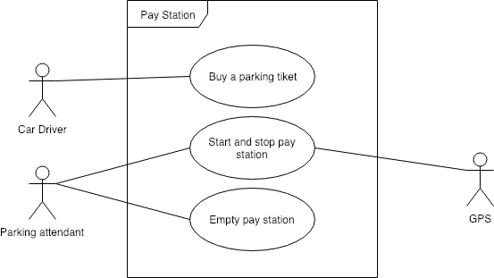

# Pay Station

## Project Abstract
_At least one paragraph description of the overall project. Include a UML use case diagram._ 

## Project Relevance
_A one paragraph explanation of how the proposal is linked to the educational goals of this class and why this goal is important goal (see list of subject in Initial Survey or slide 7 and 8 in CIS3296Introduction.pptx)_

## Conceptual Design
_A one-paragraph description of your proposed contribution._

## Background
_A URL reference to the project._

## Required Resources
- Group members
- Hardware and software resource required
